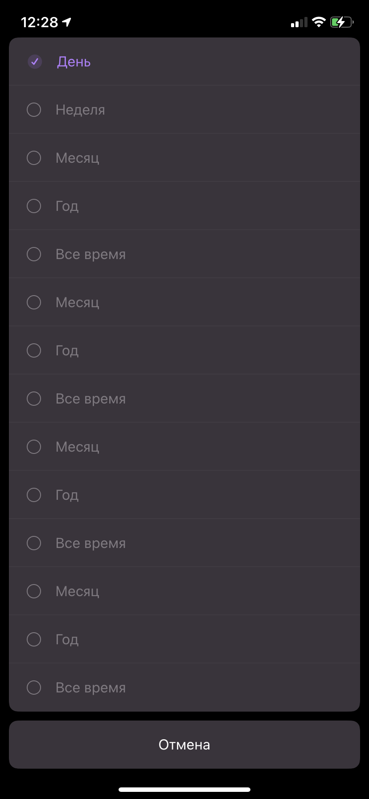
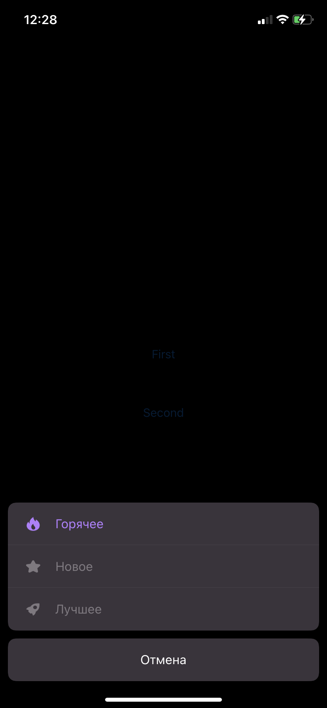

# ALActionController

**Customizale action sheet controller**. 

<p align="center">
	
	
</p>

If you like the project, don't forget to `put star ★` and follow me on GitHub:

## Navigate

- [Installation](#installation)
    - [Swift Package Manager](#swift-package-manager)
    - [CocoaPods](#cocoapods)
    - [Manually](#manually)
- [Quick Start](#quick-start)
- [Usage](#usage)

## Installation

### Swift Package Manager

The [Swift Package Manager](https://swift.org/package-manager/) is a tool for managing the distribution of Swift code. It’s integrated with the Swift build system to automate the process of downloading, compiling, and linking dependencies.

To integrate `ALActionController` into your Xcode project using Xcode 12, specify it in `File > Swift Packages > Add Package Dependency...`:

```ogdl
https://github.com/alobanov11/ALActionController
```

### CocoaPods:

[CocoaPods](https://cocoapods.org) is a dependency manager for Cocoa projects. For usage and installation instructions, visit their website. To integrate `ALActionController` into your Xcode project using CocoaPods, specify it in your `Podfile`:

```ruby
pod 'ALActionController'
```

### Manually

If you prefer not to use any of dependency managers, you can integrate `ALActionController` into your project manually. Put `Sources/ALActionController` folder in your Xcode project. Make sure to enable `Copy items if needed` and `Create groups`.

## Quick Start

First of all, you need to present controller without animated: 

```swift
let actionController = ALActionController(
  actions: [
    .init(title: "Privacy policy"),
    .init(title: "Settings"),
    .init(title: "Logout"),
    .init(title: "Cancel", style: .cancel),
  ]
)

self.present(actionController, animated: false, completion: nil)
```

## Usage

ALActionController has fully customizable properties. You can setup it easily for yourself:

```swift
let actionController = ALActionController(
  actions: [
    .init(title: "Privacy policy", selected: true, icon: #imageLiteral(resourceName: "icon3")),
    .init(title: "Settings", icon: #imageLiteral(resourceName: "icon4")),
    .init(title: "Logout", icon: #imageLiteral(resourceName: "icon5"), handler: { [weak self] in self?.onLogout?() }),
    .init(title: "Cancel", style: .cancel),
  ],
  styles: .init(
    itemStyles: .init(
      contentInsets: .init(top: 16, left: 20, bottom: 16, right: 20),
      height: 54,
      cornerRadius: 10,
      backgroundColor: .init(rgb: 0x3A343C),
      tintColor: .init(rgb: 0x7F7980),
      selectedTintColor: .init(rgb: 0xB57FFF),
      cancelTintColor: .white,
      separatorColor: UIColor(rgb: 0x7F7980).withAlphaComponent(0.1),
      separatorHeight: 1,
      font: .systemFont(ofSize: 16),
      horizontalAlignment: .left,
      iconTitlePadding: 16
    ),
    backgroundColor: UIColor.black.withAlphaComponent(0.8),
    contentInsets: .init(top: 0, left: 10, bottom: 0, right: 10),
    sectionInsets: .init(top: 0, left: 0, bottom: 10, right: 0)
  )
)
self.present(actionController, animated: false, completion: nil)
```
